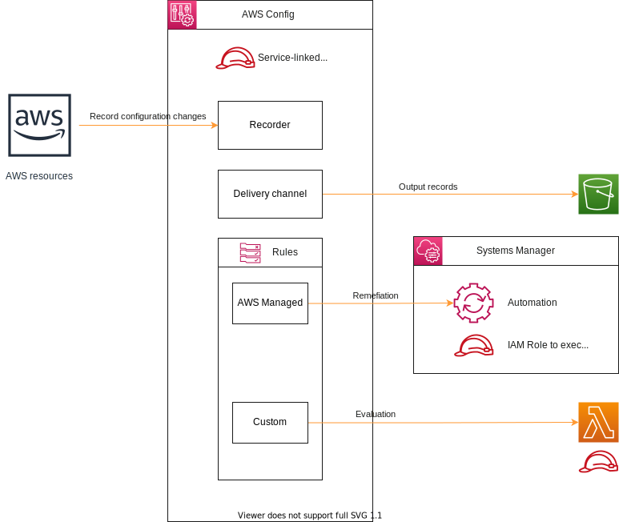

# Minimum example of AWS Config

## Architecture


## Code structure
```
terraform
├── env
│   └── example
│       ├── aws.tf
│       └── main.tf
└── module
    ├── config
    │   ├── config.tf
    │   ├── data.tf
    │   └── s3.tf
    ├── rule_aws_managed_rule_s3_bucket_public_read_prohibited
    │   └── config.tf
    └── rule_custom_rule_iam_user_no_exist_check
        ├── config.tf
        ├── lambda.tf
        ├── src
        │   └── main.py
        └── upload
            └── lambda.zip
```